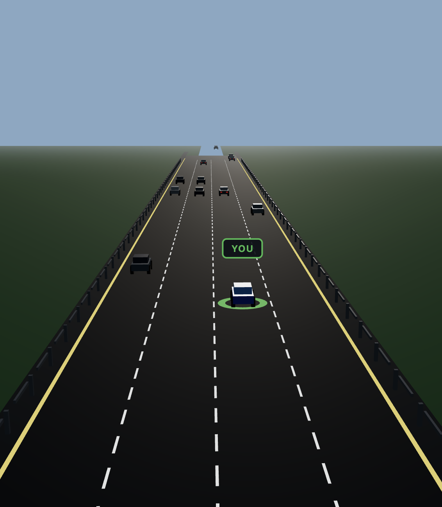
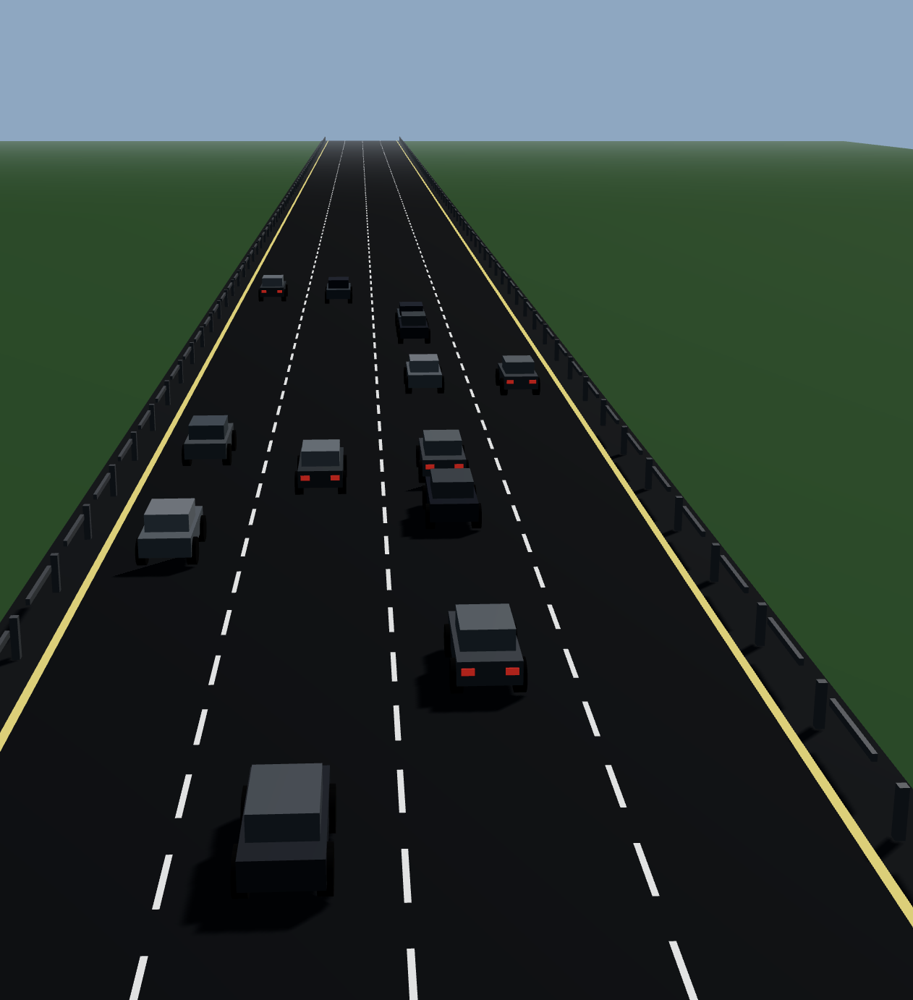
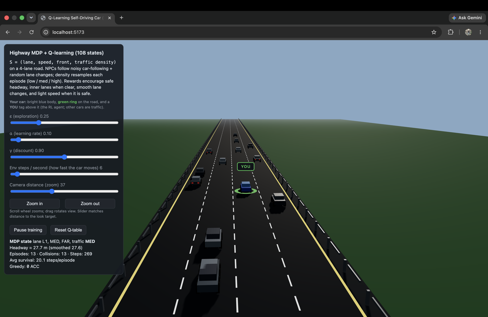

# RL Self-Driving Car

A browser-based reinforcement learning project where a tabular Q-learning agent learns to drive an ego vehicle on a 4-lane highway inside a custom traffic simulator rendered with Three.js.

## Screenshots

### Environment View


### Training Dashboard


### Learned Driving Behavior


## Highlights

- Tabular **Q-learning** with an interpretable Q-table.
- Custom **traffic environment** with multi-lane highway dynamics.
- Real-time **3D visualization** using Three.js.
- Pure frontend project, no backend required.
- Built with **Vite** for fast local development and production builds.
- Ready for **GitHub Pages deployment**.

## Demo

- Live site: `https://aadityaanand2002.github.io/rl-self-driving-car/`

## Overview

This project demonstrates how reinforcement learning can be applied to autonomous driving in a simplified highway scenario. The agent observes a discretized state, selects one of a small set of driving actions, receives a reward, and updates its Q-values over time.

The main goal is to keep the project small enough to remain easy to understand while still showing the key ideas behind:

- Markov Decision Processes (MDP)
- Q-learning updates
- Exploration vs exploitation
- Reward shaping
- Traffic simulation and visualization

## Problem Setup

The environment models a 4-lane highway where the ego car must make decisions such as accelerating, braking, or changing lanes while avoiding unsafe situations.

### State Space

The agent uses a discretized state representation with 108 total states:

- 4 lane positions
- 3 speed levels
- 3 front-distance bins
- 3 traffic density levels

State encoding:

```text
s = lane + 4 * (speed_tier + 3 * (front_bin + 3 * density))
```

### Action Space

The agent can choose from 5 actions:

- ACCELERATE
- BRAKE
- MOVE_LEFT
- MOVE_RIGHT
- KEEP_STRAIGHT

### Learning Objective

The reward design encourages:

- Safe driving
- Maintaining useful speed
- Avoiding collisions
- Avoiding unnecessary lane changes
- Staying within road boundaries

## Reinforcement Learning Flow

```text
Current State → Choose Action → Environment Step → Reward + Next State → Q-table Update
```

The update follows the standard Bellman-style Q-learning rule:

```js
Q[s][a] += alpha * (reward + gamma * Math.max(...Q[sNext]) - Q[s][a]);
```

The action policy is epsilon-greedy:

```js
if (Math.random() < epsilon) {
  return randomAction();
} else {
  return argmax(Q[state]);
}
```

## Tech Stack

| Technology | Purpose |
|---|---|
| Three.js | 3D rendering and scene visualization |
| Vite | Development server and build tool |
| Vanilla JavaScript (ES Modules) | RL logic and simulator code |
| GitHub Pages | Deployment |

## Project Structure

```text
rl-self-driving-car/
├── index.html
├── package.json
├── vite.config.js
├── src/
│   ├── main.js
│   ├── mdp.js
│   ├── qlearning.js
│   └── trafficEnvironment.js
└── dist/
```

### File Guide

- `main.js` — initializes the Three.js scene, rendering loop, and UI.
- `mdp.js` — defines state encoding, action labels, and reward logic.
- `qlearning.js` — implements Q-table creation, action selection, and Q-value updates.
- `trafficEnvironment.js` — simulates the road, cars, and transition dynamics.

## Installation

### Prerequisites

- Node.js 18+
- npm 9+

### Run Locally

```bash
npm install
npm run dev
```

The app will start on a local Vite development server.

### Build for Production

```bash
npm run build
```

The optimized output is generated in the `dist/` folder.

## Deployment

This project can be deployed on GitHub Pages.

### GitHub Pages Steps

1. Create a GitHub repository, for example: `rl-self-driving-car`
2. Push this project to the `main` branch.
3. In GitHub, open **Settings > Pages**.
4. Set the source to **GitHub Actions**.
5. The included workflow in `.github/workflows/deploy.yml` will automatically build and deploy the project.

### Important

If your repository name is different from `rl-self-driving-car`, update the `base` field in `vite.config.js` accordingly.

Example:

```js
base: '/your-repo-name/'
```

## Screenshots

Add your output screenshot as:

```text
screenshot.png
```

Place it in the root folder so it appears automatically in the README.

## Learning Notes

This project is especially useful for students who want to understand reinforcement learning visually before moving to more advanced methods such as Deep Q-Networks (DQN) or policy-gradient methods.

Because the state and action spaces are small and explicit, the behavior remains easier to inspect compared with deep learning based driving agents.

## Future Improvements

- Add training statistics charts
- Save and load learned Q-tables
- Improve reward shaping for smoother driving
- Add more realistic traffic behavior
- Extend from tabular RL to Deep RL
- Add collision heatmaps or policy visualization panels

## License

MIT License

## Author

**Aditya Anand**

## Acknowledgements

- Sutton and Barto, *Reinforcement Learning: An Introduction*
- Watkins, original Q-learning work
- Three.js documentation and community examples
